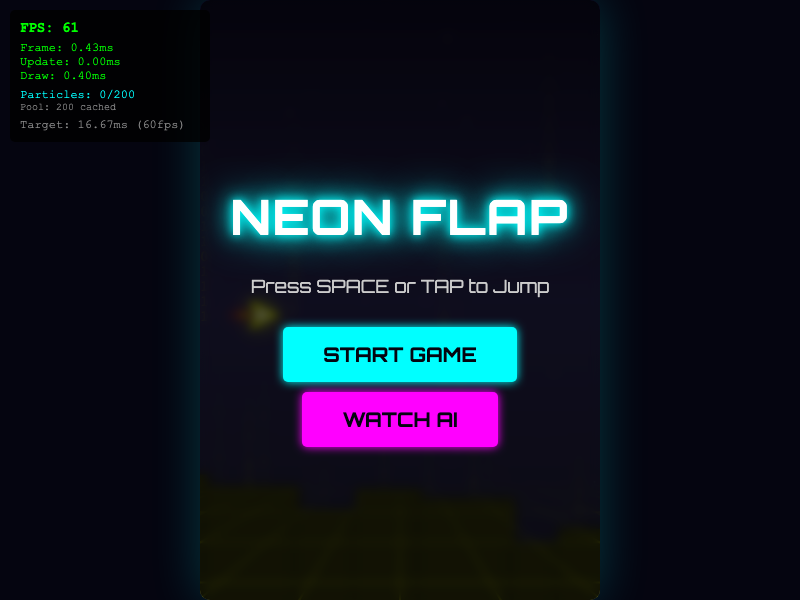
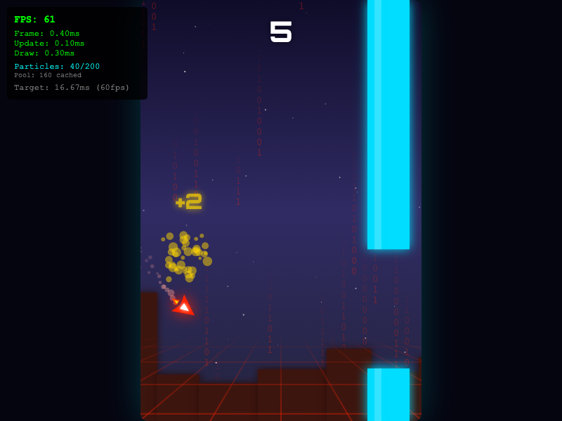

# Neon Flap

A flashy, neon-styled Flappy Bird clone that brings the classic gameplay to life with vibrant visuals and smooth mechanics.


## 🎮 About

Neon Flap is a modern web-based reimagining of the classic arcade game. It features a glowing neon aesthetic, responsive controls, and a progressively challenging difficulty curve.

This project is "vibe coded" — built with a focus on aesthetics and game feel, leveraging the capabilities of **Gemini 3** and **Claude Sonnet 4.5** to generate the core logic and design.

## ✨ Features

*   **Neon Aesthetics:** Glowing visuals and a retro-futuristic color palette.
*   **Smooth Gameplay:** Responsive physics and collision detection.
*   **Progressive Difficulty:** The game gets faster as you survive longer.
*   **High Score Tracking:** Saves your best runs locally.

## 📸 Screenshots

| Title Screen | Gameplay |
|:---:|:---:|
|  |  |

## 🚀 Getting Started

1.  **Clone the repository:**
    ```bash
    git clone https://github.com/stekman08/neon-flap.git
    cd neon-flap
    ```

2.  **Install dependencies:**
    ```bash
    npm install
    ```

3.  **Start the server:**
    ```bash
    npm start
    ```

4.  **Play:**
    Open your browser and navigate to `http://localhost:3000`.

## 🤖 AI Attribution

This game was developed as an exploration of AI-assisted coding.
*   **Core Logic & Design:** Gemini 3 & Claude Sonnet 4.5
*   **Vibe:** 100% Neon

---
*Enjoy the flight!*
